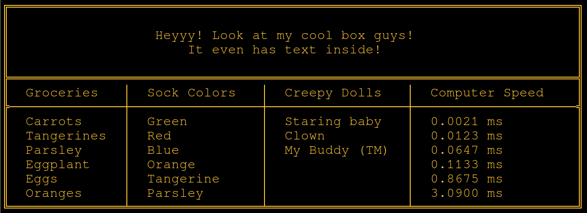

Boxy is a tiny Zig library for making boxes! If you're building a library, 
command line program, text-based game, or even a logging system, boxy might 
be for you! Just give it tabular information and it will draw super-cool 
padded boxes like this:



Neat huh? Boxes can be auto-sized to text, and text can be truncated to fit 
boxes! There are also default boxy themes, and you can eeeeeasily (easily!)
design your own themes with simple structs. That way if you want a box
surrounded by ~~~~~~~ you can have it! Want the walls to be some weird intl
character you discovered? Fine! Boxy supports ASCII, UTF-8, and maybe even
other stuff nobody but an encoding nerd would know or care about! But it means
YOU can always get the boxes you want! And you don't even have to break them
down and stuff them in a can on garbage day!

Try boxy TODAY!!1!

========================================================================

How to use!

```zig
const std  = @import("std");
const boxy = @import("boxy");

fn myCoolProgram() void {

  var box = try Boxy.new(allocator)
    .title("Heyyy! Look at my cool box guys!", "It even has text inside!")
    .orientation(.columns)
    .set("Groceries", &.{ "Carrots", "Tangerines", "Parsley", "Eggplant", "Eggs", "Oranges" })
    .set("Sock Colors", &.{ "Green", "Red", "Blue", "Orange", "Tangerine", "Parsley" })
    .set("Creepy Dolls", &.{ "Staring baby", "Clown", "My Buddy (TM)" })
    .set("Computer Speed", &.{ "0.0021 ms", "0.0123 ms", "0.0647 ms", "0.1133 ms", "0.8675 ms", "3.0900 ms" })
    .style(.pipes)
    .build();
  defer box.deinit(allocator);

  // Print it!
  try box.print(std.io.getStdOut().writer());
}
```

Fun, right? Your data stays organized in logical sets, and Boxy handles the layout!

Want to make a spreadsheet? Easy!

```zig
fn mySpreadsheet() void {

  var schedule = try Boxy.new(allocator)
    .spreadsheet()  // Special mode for row/column headers!
    .set("Staff", &.{ "Mon", "Tue", "Wed", "Thu", "Fri" })  // First set becomes column headers
    .set("Alice", &.{ "9-5", "9-5", "Off", "9-5", "9-5" })
    .set("Bob", &.{ "9-5", "Off", "12-8", "12-8", "Off" })
    .set("Carol", &.{ "Off", "9-5", "9-5", "Off", "12-8" })
    .set("Dave", &.{ "12-8", "12-8", "Off", "9-5", "9-5" })
    .style(.rounded)
    .build();
  defer schedule.deinit(allocator);

  // Prints a nice schedule table with row and column headers!
  // ╭───────┬─────┬─────┬─────┬─────┬─────╮
  // │ Staff │ Mon │ Tue │ Wed │ Thu │ Fri │
  // ├───────┼─────┼─────┼─────┼─────┼─────┤
  // │ Alice │ 9-5 │ 9-5 │ Off │ 9-5 │ 9-5 │
  // │ Bob   │ 9-5 │ Off │12-8 │12-8 │ Off │
  // │ Carol │ Off │ 9-5 │ 9-5 │ Off │12-8 │
  // │ Dave  │12-8 │12-8 │ Off │ 9-5 │ 9-5 │
  // ╰───────┴─────┴─────┴─────┴─────┴─────╯
}

try schedule.print(std.io.getStdOut().writer());
```

You can put as many sets as you want in a BoxyBox! It just works! Yay!

## Themes and Reusability

Define your border style once and use it everywhere:

```zig
// Define a custom theme
const MyCorpTheme = BoxyTheme{
    .top = "▀█▀",
    .bottom = "▄█▄", 
    .left = "█",
    .right = "█",
    .tl = "◢", .tr = "◣",
    .bl = "◥", .br = "◤",
    .inner = .{
        .h = "─",
        .v = "│",
        .section = "═",
    },
};

// Use it in all your boxes!
var report = try Boxy.new(allocator)
    .theme(MyCorpTheme)
    .title("Q4 Report")
    .build();
```

Or create pre-configured factories for consistency:

```zig
const ErrorBox = Boxy.factory(allocator, .{
    .theme = RedAlertTheme,
    .padding = 3,
});

const SuccessBox = Boxy.factory(allocator, .{
    .theme = GreenCheckTheme,
    .padding = 2,
});

// Semantic and consistent!
var error = try ErrorBox.new()
    .title("⚠ Error!")
    .set("Details", &.{ "File not found" })
    .build();
```

## Size Control and Text Alignment

Control your box dimensions and text layout:

```zig
var box = try Boxy.new(allocator)
    .width(.{ .exact = 80 })        // Exactly 80 chars wide
    .height(.{ .min = 10 })          // At least 10 lines tall
    .columnWidth("Name", .{ .max = 20 })  // Truncate long names
    .align(.center)                  // Center all text
    .truncate("...")                 // Custom truncation indicator
    .build();
```

Or use simple presets:

```zig
.size(.compact)    // Minimal padding, tight fit
.size(.comfort)    // Nice readable spacing (default)
.size(.spacious)   // Generous padding
```

## Canvas Mode - For Games and Dynamic Content

Need a space for ASCII art, animations, or dynamic content? Use canvas mode:

```zig
// Create a box with a blank canvas inside
var display = try Boxy.new(allocator)
    .title("Game Display")
    .canvas(40, 20)  // 40 chars wide, 20 lines tall
    .build();

// Get the canvas to draw on
var canvas = display.getCanvas();  // 2D array of u8

// Draw individual characters
canvas[5][10] = '@';  // Player position
canvas[5][11] = '>';  // Player sword

// Blit text strings
display.blitText(10, 5, "SCORE: 1000");

// Blit multi-line ASCII art
const dragon = 
    \\    /\__/\
    \\   (  o.o )
    \\    > ^ <
;
display.blitBlock(20, 8, dragon);

// Refresh just the content (keeps borders intact)
try display.refreshCanvas();
```

This gives you a clean, bordered area to work with - perfect for:
- ASCII animations
- Game displays  
- Live data visualization
- Text-based drawing programs

Boxy handles the box structure, you handle the content!

## Philosophy: Composable, Not Comprehensive

Boxy focuses on doing ONE thing really well: making boxes. It's not a terminal UI framework, game engine, or spreadsheet app. But it IS designed to work beautifully with whatever you want to build:

```zig
// Boxy provides the primitives
const coords = box.getCoords();  // Where is this box?
const inner = box.getContentArea();  // Usable space inside
var buffer = box.getRawCanvas();  // Direct buffer access

// You build whatever you want on top!
// - Input handling? Add your own library
// - Colors? Insert ANSI codes into the canvas  
// - Cursor movement? Use the coords Boxy provides
// - Animations? Update the canvas in a loop
```

Want terminal positioning? Here's how to do it yourself:
```zig
// Position cursor at row 5, column 10
writer.print("\x1b[5;10H", .{});
// Clear screen
writer.print("\x1b[2J", .{});
// Then print your box!
try box.print(writer);
```

Boxy makes delightful boxes. What you put in them is up to you!

